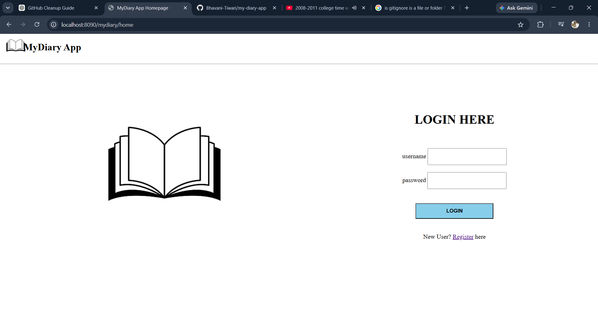

# My Diary App 📖

## Overview

My Diary App is a web-based personal diary management system developed using Java Spring MVC, Hibernate, JSP, and MySQL. The application allows users to securely register, log in, and manage their personal diary entries through a simple and intuitive interface.

This project demonstrates the implementation of the MVC architecture, CRUD operations, database connectivity, session handling, and user authentication in a real-world web application.

## Features

* User Registration
* User Login Authentication
* Create Diary Entries
* View Diary Entries
* Update Existing Entries
* Delete Diary Entries
* Session Management
* MySQL Database Integration
* Responsive and User-Friendly Interface

## Technologies Used

### Backend

* Java
* Spring MVC
* Hibernate
* Maven

### Frontend

* JSP
* HTML
* CSS

### Database

* MySQL

## Project Structure

```text
mydiary
│
├── src/
│   ├── main/java
│   ├── main/webapp
│   └── resources
│
├── screenshots/
├── pom.xml
└── README.md
```

## How to Run

### Prerequisites

* Java JDK 8+
* Apache Tomcat
* MySQL Server
* Maven

### Setup

1. Clone the repository

```bash
git clone https://github.com/Bhavani-Tiwari/my-diary-app.git
```

2. Import the project into Eclipse or Spring Tool Suite.

3. Configure MySQL database settings.

4. Create the required database tables.

5. Build the project using Maven.

6. Deploy the generated WAR file to Apache Tomcat.

7. Start the server and access the application through your browser.

## Screenshots

### Login Page



### Registration Page


### User Home Page


### Add Entry Page


### View Entry Page


### Update Entry Page


## Learning Outcomes

* Spring MVC Architecture
* Hibernate ORM Integration
* CRUD Operations
* JSP Development
* Session Management
* Maven Project Structure
* MySQL Database Connectivity
* Full Stack Web Application Development

## Future Enhancements

* Password Encryption
* Search Diary Entries
* Entry Categories and Tags
* Rich Text Editor Support
* Profile Management
* Cloud Deployment

## Author

**Bhavani Tiwari**

Aspiring Java Full Stack Developer passionate about building practical applications and continuously improving software development skills.

GitHub: https://github.com/Bhavani-Tiwari
